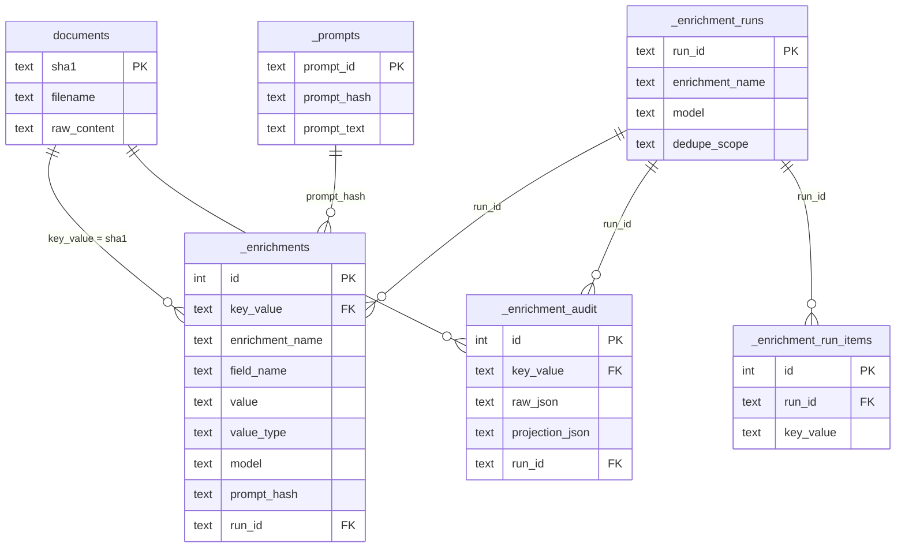

# Data model

Source tables or views keep the original inputs. `documents` is the name of the default table that stores the primary corpus.

The rows you want to enrich are defined in SQL:

```yaml
sql_queries:
  all_docs: |
    SELECT rowid, sha1 FROM documents
```

The query must return a stable key column. `sha1` is the default, because it assumes that the text came from a file (like a pdf, docx, html, etc.; and a sha1 is a unique identifier for a file). Use `key_column` when the source uses a different identifier.

## Schema at a glance

How the ledger links back to your documents. Joins are by the key column (default `sha1`); these are logical relationships, not enforced SQLite foreign keys. Views (`v_`) are not shown — they are pivots computed over `_enrichments`.



## Normalized storage

`_enrichment_audit` stores raw calls, raw responses, prompt/query provenance, errors, and the normalized projection payload used for rebuilds.

`_enrichments` stores parsed fields in long form:

```text
key_value | enrichment_name | field_name | value | model | prompt_hash | run_id
```

The current row identity is key, enrichment name, field, model, and prompt hash. Upserts keep the current value for that identity while raw responses and projection payloads remain available in audit history; migration side tables preserve recoverable legacy duplicates.

`_prompts` stores prompt text, system prompt text, model, and prompt hash.

`_enrichment_runs` stores run-level provenance: query SQL/hash, model, prompt id, key column, source name, dedupe scope, project, and execution mode.

`_enrichment_run_items` stores the exact input rowset for a run when materialization is enabled.

Doctrail-managed tables use a leading underscore so they do not look like source tables. Schema migration 2 renames older `enrichments`, `enrichment_audit`, `enrichment_runs`, and related bookkeeping tables when it opens an existing database.

## Dedupe

Append mode skips rows only after a successful normalized result exists in `_enrichments` for the dedupe scope. Audit rows alone are not completion.

Null answers are still answers. A parsed null is stored in `_enrichments` with `value_type = 'null'`, so append mode will not resubmit the same row for the same dedupe scope. View type detection ignores those null rows when deciding whether a field should be cast as numeric.

Scopes:

| Scope | Meaning |
| --- | --- |
| `query` | same enrichment, model, prompt, and query |
| `prompt` | same enrichment, model, and prompt |
| `enrichment` | same enrichment and model |
| `name` | legacy alias for `enrichment` |

## Views

Run views show one persisted run in wide form. They are best for pilot runs, final runs, and human review.

Pivot views build reusable wide analysis surfaces over normalized enrichments.

Spec views are YAML-defined review surfaces. They can include source columns, enrichment columns, and one exploded JSON-array field.

Final views and final tables layer human overrides or materialize an editable dataset without changing the original model run.

Doctrail-managed views are prefixed with `v_`. For example, a run view is named like `v_run_<enrichment>_<timestamp>`, a spec view named `payments_review` is created as `v_payments_review`, and a final view is named like `v_final_<enrichment>_<timestamp>`.

Model-collapse caveat: default views choose a current/latest value per field. Use `--by-model`, run-specific views, or explicit fields when comparing models.
